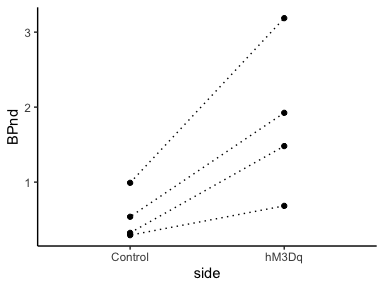

## Setting


```r
library(tidyverse)

theme_set(theme_classic() +
            theme(strip.background = element_rect(color = "white"),
                  legend.title = element_blank()))

.colors <- c("dodgerblue", "magenta")

path <- "data/data_DCZ-PET.csv"
```


## Data


```r
dat <-
  path %>% 
  read_csv() %>% 
  mutate(x = side %>% factor() %>% as.numeric())

dat
```

```
## # A tibble: 8 x 7
##   ID     injection     date VOI                 side     BPnd     x
##   <chr>      <dbl>    <dbl> <chr>               <chr>   <dbl> <dbl>
## 1 Marmo1  20180319 20180501 Substantia nigra_Rt hM3Dq   1.92      2
## 2 Marmo1  20180319 20180501 Substantia nigra_Lt Control 0.538     1
## 3 Marmo4  20170614 20170809 Substantia nigra_Rt Control 0.323     1
## 4 Marmo4  20170614 20170809 Substantia nigra_Lt hM3Dq   1.48      2
## 5 Marmo2  20180329 20180529 Substantia nigra_Rt Control 0.991     1
## 6 Marmo2  20180329 20180529 Substantia nigra_Lt hM3Dq   3.19      2
## 7 Marmo3  20200917 20201110 Substantia nigra_Lt hM3Dq   0.683     2
## 8 Marmo3  20200917 20201110 Substantia nigra_Rt Control 0.293     1
```

## Visualization


```r
ggplot(data = dat) +
  aes(x = side, y = BPnd) +
  geom_path(aes(group = date), linetype = "dotted") +
  geom_point()
```

<!-- -->
