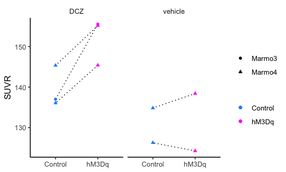

## Setting


```r
library(tidyverse)

theme_set(theme_classic() +
            theme(strip.background = element_rect(color = "white"),
                  legend.title = element_blank()))

.colors <- c("dodgerblue", "magenta")

path <- "data/data_FDG-PET.csv"
```

## Data


```r
dat <-
  path %>% 
  read_csv()
```

## Visualization


```r
ggplot(data = dat) +
  aes(x = type, y = SUVR) +
  geom_path(aes(group = date), linetype = "dotted") +
  geom_point(aes(shape = ID, color = type)) +
  scale_color_manual(values = .colors) +
  facet_wrap(~condition) +
  theme(axis.title.x = element_blank())
```

<!-- -->
