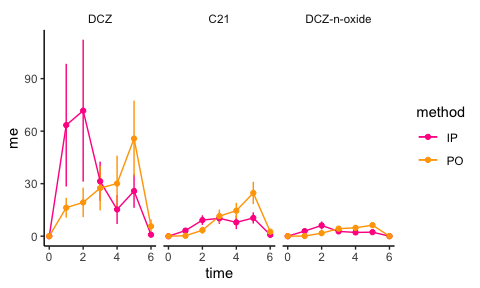

## Setting


```r
library(tidyverse)

theme_set(theme_classic())

.colors <- c("deeppink", "orange")
```

## Data


```r
dat <- 
  "data/data_pk.csv" %>% 
  read_csv() %>% 
  mutate(target = factor(target, levels = c("DCZ", "C21", "DCZ-n-oxide")))

dat
```

```
## # A tibble: 42 x 5
##    method target  time     me    sem
##    <chr>  <fct>  <dbl>  <dbl>  <dbl>
##  1 IP     C21        0  0      0    
##  2 IP     C21        1  3.18   0.772
##  3 IP     C21        2  9.19   2.74 
##  4 IP     C21        3 10.2    3.19 
##  5 IP     C21        4  7.90   3.88 
##  6 IP     C21        5 10.4    3.20 
##  7 IP     C21        6  0.768  0.547
##  8 IP     DCZ        0  0      0    
##  9 IP     DCZ        1 63.4   35.0  
## 10 IP     DCZ        2 71.7   40.5  
## # … with 32 more rows
```

## Visualization


```r
ggplot(data = dat) +
  aes(x = time, y = me, color = method) +
  geom_segment(aes(x = time, xend = time,
                   y = me - sem, yend = me + sem)) +
  geom_path() +
  geom_point() +
  scale_color_manual(values = .colors) +
  facet_wrap(~ target) +
  theme(strip.background = element_rect(color = "white"),
        legend.title = element_blank())
```

<!-- -->
